# Bon v2 – Datamodel (opdateret)

> **Version:** 2.0  
> **Dato:** 4. februar 2026  
> **Grundlag:** v1 produktionserfaring (3 år) + beslutninger fra systemoverblik  
> **Ændringer fra v1.0:** Mail, flyver, adresser, priskategorier, geo, prep, tilbud, CO₂

---

## Designprincipper

1. **Bevar det der virker fra v1** – mail-integration, flyver, kalender, kitchen_selects
2. **Forbedre det der irriterer** – log flyver-beskeder, strukturér kundedata, bedre indkøb
3. **Status-systemet er konfigurérbart** – labels, farver, rækkefølge, transitions
4. **Changelog på alt** – alle ændringer logges automatisk
5. **Grocy ejer lager/opskrifter** – Bon v2 læser via adapter, snapshot gemmes lokalt
6. **Klar til videresalg** – konfigurérbart uden kodeændringer
7. **SQLite** – enkelt, selvhostet, ingen ekstern database
8. **Alle enheder** – telefon, tablet, PC, Mac

---

## Ændringer fra v2 datamodel v1.0

| Tilføjet | Grund |
|----------|-------|
| `addresses` tabel | Genbrugbare adresser med lat/lon (som v1) |
| `bon_mails` tabel | Mail-korrespondance knyttet til bon (v1 feature) |
| `notifications` + `notification_reads` | Flyver-system MED persistent besked (v1 forbedring) |
| `price_categories` + `item_prices` | Fleksibel prismodel (catering/festival/kunde) |
| `geo_calculations` tabel | Afstand/varighed beregning per bon (som v1) |
| `quotes` + `quote_lines` | Tilbud som separat entity der kan konverteres |
| `kitchen_selects`, `customer_collects` på bons | Flags fra v1 |
| `payment_type` på bons | Betalingsmetode (faktura/kort/mobilepay/kontant/pos) |
| `prep_ingredients_ready`, `prep_supplies_ready` på bons | Prep-tjek fra v1 |
| `co2e` på bon_lines | CO₂-tracking per linje (som v1) |
| `discount_percent` på companies | Kundespecifik rabat |
| `pos_product_id` på bon_lines | iZettle/POS reference |
| `locations` tabel | HQ, Trailer, Test – med hver sin Grocy-forbindelse |
| `location_id` på bons | Hvilken lokation ordren hører til |
| `economic_customer_id` på companies | Klar til e-conomic integration |
| `invoice_method` på companies | Hvordan faktura sendes (email/EAN/portal) |

| Fjernet/ændret | Grund |
|----------------|-------|
| Inline adresse på bons | Erstattet af delivery_address_id → addresses |
| Simpel unit_price | Erstattet af priskategori-system |

---

## ER-diagram

```mermaid
erDiagram
    %% ==========================================
    %% STATUS-SYSTEM (konfigurérbart)
    %% ==========================================
    
    status_definitions {
        int id PK
        text code UK "Fast kode brugt i app-logik"
        text label "Visningsnavn (kan ændres)"
        text color "Hex farve"
        text icon "Emoji eller ikon-navn"
        int sort_order "Rækkefølge i flowet"
        boolean is_active "Kan slås fra"
        boolean is_terminal "Slutstatus"
        text category "normal | terminal | cancel"
    }

    status_transitions {
        int id PK
        int from_status_id FK
        int to_status_id FK
        boolean is_active "Kan slås fra"
        boolean requires_confirmation "Vis bekræftelsesdialog"
        text confirmation_message "Tekst i dialogen"
        text triggers_json "JSON array af trigger-typer"
    }

    %% ==========================================
    %% ADRESSER (genbrugbare, med geo)
    %% ==========================================

    addresses {
        int id PK
        text street_name
        text street_name2 "Etage, suite etc"
        text street_nr
        text postal_code
        text city
        real lat "Breddegrad"
        real lon "Længdegrad"
        datetime created_at
        datetime updated_at
    }

    %% ==========================================
    %% LOKATIONER
    %% ==========================================

    locations {
        int id PK
        text name "HQ, Trailer, Test"
        text code UK "hq | trailer | test"
        text grocy_api_url "Grocy API for denne lokation"
        text grocy_api_key "Grocy API-nøgle"
        text address "Fysisk adresse"
        boolean is_active
        datetime created_at
    }

    %% ==========================================
    %% KUNDER & FIRMAER
    %% ==========================================

    companies {
        int id PK
        text name "Firmanavn"
        text cvr "CVR-nummer"
        text ean "EAN-nummer til fakturering"
        text economic_customer_id "e-conomic kunde-ID"
        int address_id FK "Firmaadresse"
        text phone
        text email
        text invoice_email "Evt separat faktura-mail"
        text invoice_method "email | ean | portal (kun ved faktura)"
        text default_payment_type "invoice | card | mobilepay | cash | pos"
        real discount_percent "Kundespecifik rabat"
        int default_price_category_id FK "Standard priskategori"
        text notes
        boolean is_active
        datetime created_at
        datetime updated_at
    }

    customers {
        int id PK
        int company_id FK "Nullable - privatperson"
        text first_name
        text last_name
        text phone
        text email
        text economic_contact_id "e-conomic kontakt-ID (under firma)"
        text economic_customer_id "e-conomic kunde-ID (kun privatkunder)"
        boolean is_primary_contact "Hovedkontakt for firma"
        text notes
        boolean is_active
        datetime created_at
        datetime updated_at
    }

    %% ==========================================
    %% PRISKATEGORIER
    %% ==========================================

    price_categories {
        int id PK
        text code UK "catering | festival | custom"
        text label "Visningsnavn"
        boolean is_default "Standard kategori"
        boolean is_active
    }

    item_prices {
        int id PK
        int item_id "Grocy product_id eller lokal item_id"
        int price_category_id FK
        real price "Salgspris i denne kategori"
        datetime updated_at
    }

    %% ==========================================
    %% BONNER (ORDRER)
    %% ==========================================

    bons {
        int id PK
        text bon_number UK "Sekventielt: 3242, 3243..."
        int status_id FK
        int location_id FK "HQ, Trailer etc"
        int customer_id FK
        int company_id FK "Redundant men praktisk"
        int price_category_id FK "Priskategori for denne bon"

        date order_date
        date delivery_date
        text pickup_time "Hvornår maden skal være klar"
        text delivery_time "Hvornår kunden skal have maden"

        text delivery_type "delivery | pickup | event"
        text delivery_method "bike | taxi | volvo | pickup"
        int delivery_address_id FK "Link til addresses"
        text delivery_notes
        real delivery_cost "Kostpris"
        real delivery_price "Kundepris"
        text courier_arrival_time "Hvornår bud ankommer"
        text courier_provider "byekspressen | taxa | intern"

        int pax "Antal personer"
        int total_units "Samlet antal enheder"
        int boxes "Antal transportkasser"

        real total_price "Samlet pris ekskl levering"
        real total_with_delivery "Samlet pris inkl levering"

        text payment_type "invoice | card | mobilepay | cash | pos"
        boolean kitchen_selects "Ristet Rug vælger menu"
        boolean customer_collects "Kunden afhenter selv"

        text kitchen_info "Info til køkkenet (synlig på bon-kort)"
        text customer_wishes "Kundens ønsker fra formular"
        text internal_notes "Interne noter"
        text invoice_info "Fakturainformation"

        boolean prep_ingredients_ready "Råvarer fundet/optøet"
        boolean prep_supplies_ready "Emballage klargjort"

        boolean inventory_deducted "Er varer trukket fra lager"
        datetime inventory_deducted_at

        int created_by_user_id FK
        datetime created_at
        datetime updated_at
    }

    bon_lines {
        int id PK
        int bon_id FK
        int grocy_recipe_id "Link til Grocy opskrift"
        text product_name "Snapshot - gemt lokalt"
        text category "Snapshot af kategori"
        int quantity
        text unit "stk, portion, boks"
        real cost_price "Kostpris (fra Grocy)"
        real unit_price "Salgspris (fra priskategori)"
        real line_total "quantity x unit_price"
        int sort_order
        boolean is_accessory "Transportkasse, servietter etc"
        text special_request "Særlige ønsker for denne linje"
        real co2e "CO₂-aftryk per enhed"
        int pos_product_id "iZettle/POS reference"
        text notes
        datetime created_at
    }

    %% ==========================================
    %% TILBUD (separat entity)
    %% ==========================================

    quotes {
        int id PK
        text quote_number UK "T-0042"
        int customer_id FK
        int company_id FK
        text price_category "catering, store, festival..."
        date quote_date
        date valid_until "Gyldig til"
        date delivery_date "Ønsket leveringsdato"
        text delivery_time "HH:MM"
        int pax
        text delivery_type "delivery, pickup"
        int delivery_address_id FK
        real delivery_price "Leveringspris"
        text delivery_note "Bud-info"
        text template "event, single, custom"
        text price_mode "total, block, line"
        real discount_percent "Rabat i procent"
        real total_price
        text notes "Intern note"
        text customer_wishes "Kundens ønsker"
        text status "draft | sent | accepted | declined | expired"
        int converted_to_bon_id FK "Null indtil konverteret"
        int created_by_user_id FK
        datetime created_at
        datetime updated_at
    }

    quote_lines {
        int id PK
        int quote_id FK
        text block_type "morning, lunch, amsnack, pmsnack"
        int grocy_recipe_id
        text product_name
        int quantity
        text unit
        real unit_price
        real cost_price
        real line_total
        int sort_order
        text notes
    }

    %% ==========================================
    %% BRUGERE
    %% ==========================================

    users {
        int id PK
        text name
        text email
        text role "admin | office | kitchen | delivery"
        text pin "Simpel login til køkken-tablet"
        boolean is_active
        datetime created_at
    }

    %% ==========================================
    %% MAIL (bon-korrespondance)
    %% ==========================================

    bon_mails {
        int id PK
        int bon_id FK
        text message_id "Email Message-ID"
        text in_reply_to "Reply-chain"
        text from_address
        text to_address
        text subject
        text body_text
        text body_html
        text direction "inbound | outbound"
        boolean is_read
        boolean is_flagged "Kræver handling"
        datetime received_at
        datetime created_at
    }

    %% ==========================================
    %% FLYVER / NOTIFIKATIONER
    %% ==========================================

    notifications {
        int id PK
        int bon_id FK "Nullable - kan være generel"
        text type "flyver | status_change | reminder | system"
        text message "Besked (PERSISTERES nu!)"
        text priority "normal | urgent"
        int sent_by_user_id FK
        datetime created_at
    }

    notification_reads {
        int id PK
        int notification_id FK
        int user_id FK
        datetime read_at
    }

    %% ==========================================
    %% GEO / LEVERING
    %% ==========================================

    geo_calculations {
        int id PK
        int bon_id FK
        int address_id FK
        real distance_meters
        real duration_seconds
        text route_geojson "Rutedata"
        datetime calculated_at
    }

    delivery_events {
        int id PK
        int bon_id FK
        text event_type "booked | assigned | picked_up | delivered | failed | cancelled"
        text provider "byekspressen | taxa | intern"
        text external_reference "Booking-ID hos budfirma"
        text notes
        int user_id FK
        datetime event_time
    }

    %% ==========================================
    %% CHANGELOG (AUDIT TRAIL)
    %% ==========================================

    changelog {
        int id PK
        text entity_type "bon | customer | company | quote | status_def"
        int entity_id
        text action "create | update | delete | status_change"
        text field_name "Hvilket felt ændret"
        text old_value
        text new_value
        int user_id FK
        text notes "Valgfri kommentar"
        datetime created_at
    }

    %% ==========================================
    %% VEDHÆFTNINGER
    %% ==========================================

    attachments {
        int id PK
        text entity_type "bon | company | customer | quote"
        int entity_id
        text file_name
        text file_path
        text file_type "image | pdf | document"
        text description
        int uploaded_by_user_id FK
        datetime created_at
    }

    %% ==========================================
    %% SETTINGS
    %% ==========================================

    settings {
        text key PK
        text value
        text description
        datetime updated_at
    }

    %% ==========================================
    %% RELATIONER
    %% ==========================================

    addresses ||--o{ companies : "adresse"
    addresses ||--o{ bons : "levering til"
    addresses ||--o{ quotes : "levering til"
    addresses ||--o{ geo_calculations : "beregnet for"
    
    locations ||--o{ bons : "hører til"
    
    companies ||--o{ customers : "har kontakter"
    companies ||--o{ bons : "tilknyttet"
    companies ||--o{ quotes : "tilknyttet"
    price_categories ||--o{ companies : "standard pris"
    
    customers ||--o{ bons : "bestiller"
    customers ||--o{ quotes : "modtager"
    
    status_definitions ||--o{ bons : "har status"
    status_definitions ||--o{ status_transitions : "fra"
    status_definitions ||--o{ status_transitions : "til"
    
    price_categories ||--o{ bons : "priskategori"
    price_categories ||--o{ quotes : "priskategori"
    price_categories ||--o{ item_prices : "har priser"
    
    bons ||--o{ bon_lines : "indeholder"
    bons ||--o{ bon_mails : "korrespondance"
    bons ||--o{ notifications : "notifikationer"
    bons ||--o{ delivery_events : "leveringshistorik"
    bons ||--o{ geo_calculations : "afstandsberegning"
    bons ||--o{ attachments : "vedhæftninger"
    
    quotes ||--o{ quote_lines : "indeholder"
    quotes ||--o{ bons : "konverteret til"
    
    notifications ||--o{ notification_reads : "læst af"
    users ||--o{ notification_reads : "har læst"
    users ||--o{ notifications : "sendt af"
    users ||--o{ bons : "oprettet af"
    users ||--o{ changelog : "ændret af"
    users ||--o{ delivery_events : "registreret af"
```



---

## SQL: Opret tabeller

```sql
-- ==========================================
-- SETTINGS
-- ==========================================

CREATE TABLE settings (
    key TEXT PRIMARY KEY,
    value TEXT NOT NULL,
    description TEXT,
    updated_at DATETIME DEFAULT CURRENT_TIMESTAMP
);

-- ==========================================
-- BRUGERE
-- ==========================================

CREATE TABLE users (
    id INTEGER PRIMARY KEY AUTOINCREMENT,
    name TEXT NOT NULL,
    email TEXT,
    role TEXT NOT NULL DEFAULT 'kitchen'
        CHECK (role IN ('admin', 'office', 'kitchen', 'delivery')),
    pin TEXT,
    is_active INTEGER NOT NULL DEFAULT 1,
    created_at DATETIME NOT NULL DEFAULT CURRENT_TIMESTAMP,
    -- Mobile "Nye"-listen — sidste gang brugeren åbnede Nye-tabben eller
    -- trykkede "Marker alle læst" (migration 064)
    new_bons_last_seen_at DATETIME
);

-- ==========================================
-- STATUS-SYSTEM
-- ==========================================

CREATE TABLE status_definitions (
    id INTEGER PRIMARY KEY AUTOINCREMENT,
    code TEXT NOT NULL UNIQUE,
    label TEXT NOT NULL,
    color TEXT,
    icon TEXT,
    sort_order INTEGER NOT NULL,
    is_active INTEGER NOT NULL DEFAULT 1,
    is_terminal INTEGER NOT NULL DEFAULT 0,
    category TEXT NOT NULL DEFAULT 'normal'
        CHECK (category IN ('normal', 'terminal', 'cancel'))
);

CREATE TABLE status_transitions (
    id INTEGER PRIMARY KEY AUTOINCREMENT,
    from_status_id INTEGER NOT NULL REFERENCES status_definitions(id),
    to_status_id INTEGER NOT NULL REFERENCES status_definitions(id),
    is_active INTEGER NOT NULL DEFAULT 1,
    requires_confirmation INTEGER NOT NULL DEFAULT 0,
    confirmation_message TEXT,
    triggers_json TEXT,
    UNIQUE(from_status_id, to_status_id)
);

-- ==========================================
-- ADRESSER
-- ==========================================

CREATE TABLE addresses (
    id INTEGER PRIMARY KEY AUTOINCREMENT,
    street_name TEXT,
    street_name2 TEXT,
    street_nr TEXT,
    postal_code TEXT,
    city TEXT,
    lat REAL,
    lon REAL,
    created_at DATETIME NOT NULL DEFAULT CURRENT_TIMESTAMP,
    updated_at DATETIME NOT NULL DEFAULT CURRENT_TIMESTAMP
);

-- ==========================================
-- LOKATIONER
-- ==========================================

CREATE TABLE locations (
    id INTEGER PRIMARY KEY AUTOINCREMENT,
    name TEXT NOT NULL,
    code TEXT NOT NULL UNIQUE,
    grocy_api_url TEXT,
    grocy_api_key TEXT,
    address TEXT,
    is_active INTEGER NOT NULL DEFAULT 1,
    created_at DATETIME NOT NULL DEFAULT CURRENT_TIMESTAMP
);

-- ==========================================
-- PRISKATEGORIER
-- ==========================================

CREATE TABLE price_categories (
    id INTEGER PRIMARY KEY AUTOINCREMENT,
    code TEXT NOT NULL UNIQUE,
    label TEXT NOT NULL,
    is_default INTEGER NOT NULL DEFAULT 0,
    is_active INTEGER NOT NULL DEFAULT 1
);

CREATE TABLE item_prices (
    id INTEGER PRIMARY KEY AUTOINCREMENT,
    item_id INTEGER NOT NULL,
    price_category_id INTEGER NOT NULL REFERENCES price_categories(id),
    price REAL NOT NULL,
    updated_at DATETIME NOT NULL DEFAULT CURRENT_TIMESTAMP,
    UNIQUE(item_id, price_category_id)
);

-- ==========================================
-- KUNDER & FIRMAER
-- ==========================================

CREATE TABLE companies (
    id INTEGER PRIMARY KEY AUTOINCREMENT,
    name TEXT NOT NULL,
    cvr TEXT,
    ean TEXT,
    economic_customer_id TEXT,
    address_id INTEGER REFERENCES addresses(id),
    phone TEXT,
    email TEXT,
    invoice_email TEXT,
    invoice_method TEXT
        CHECK (invoice_method IN ('email', 'ean', 'portal')),
    default_payment_type TEXT
        CHECK (default_payment_type IN ('invoice', 'card', 'mobilepay', 'cash', 'pos')),
    discount_percent REAL,
    default_price_category_id INTEGER REFERENCES price_categories(id),
    notes TEXT,
    is_active INTEGER NOT NULL DEFAULT 1,
    created_at DATETIME NOT NULL DEFAULT CURRENT_TIMESTAMP,
    updated_at DATETIME NOT NULL DEFAULT CURRENT_TIMESTAMP
);

CREATE TABLE customers (
    id INTEGER PRIMARY KEY AUTOINCREMENT,
    company_id INTEGER REFERENCES companies(id),
    first_name TEXT NOT NULL,
    last_name TEXT,
    phone TEXT,
    email TEXT,
    economic_contact_id TEXT,
    economic_customer_id TEXT,
    is_primary_contact INTEGER NOT NULL DEFAULT 0,
    notes TEXT,
    is_active INTEGER NOT NULL DEFAULT 1,
    created_at DATETIME NOT NULL DEFAULT CURRENT_TIMESTAMP,
    updated_at DATETIME NOT NULL DEFAULT CURRENT_TIMESTAMP
);

CREATE INDEX idx_customers_company ON customers(company_id);

-- ==========================================
-- BONNER
-- ==========================================

CREATE TABLE bons (
    id INTEGER PRIMARY KEY AUTOINCREMENT,
    bon_number TEXT NOT NULL UNIQUE,
    status_id INTEGER NOT NULL REFERENCES status_definitions(id),
    location_id INTEGER NOT NULL REFERENCES locations(id),
    customer_id INTEGER REFERENCES customers(id),
    company_id INTEGER REFERENCES companies(id),
    price_category_id INTEGER REFERENCES price_categories(id),

    -- Datoer & tider
    order_date DATE NOT NULL,
    delivery_date DATE NOT NULL,
    pickup_time TEXT,
    delivery_time TEXT,
    
    -- Levering
    delivery_type TEXT NOT NULL DEFAULT 'delivery'
        CHECK (delivery_type IN ('delivery', 'pickup', 'event')),
    delivery_method TEXT
        CHECK (delivery_method IN ('bike', 'taxi', 'volvo', 'pickup', NULL)),
    delivery_address_id INTEGER REFERENCES addresses(id),
    delivery_notes TEXT,
    delivery_cost REAL,
    delivery_price REAL,
    courier_arrival_time TEXT,
    courier_provider TEXT,

    -- Mængder
    pax INTEGER,
    total_units INTEGER,
    boxes INTEGER,

    -- Priser
    total_price REAL,
    total_with_delivery REAL,

    -- Flags
    payment_type TEXT
        CHECK (payment_type IN ('invoice', 'card', 'mobilepay', 'cash', 'pos')),
    kitchen_selects INTEGER NOT NULL DEFAULT 0,
    customer_collects INTEGER NOT NULL DEFAULT 0,

    -- Noter
    kitchen_info TEXT,
    customer_wishes TEXT,
    internal_notes TEXT,
    invoice_info TEXT,

    -- Prep-tjek
    prep_ingredients_ready INTEGER NOT NULL DEFAULT 0,
    prep_supplies_ready INTEGER NOT NULL DEFAULT 0,

    -- Lagertræk
    inventory_deducted INTEGER NOT NULL DEFAULT 0,
    inventory_deducted_at DATETIME,

    -- Meta
    created_by_user_id INTEGER REFERENCES users(id),
    created_at DATETIME NOT NULL DEFAULT CURRENT_TIMESTAMP,
    updated_at DATETIME NOT NULL DEFAULT CURRENT_TIMESTAMP
);

CREATE INDEX idx_bons_status ON bons(status_id);
CREATE INDEX idx_bons_location ON bons(location_id);
CREATE INDEX idx_bons_delivery_date ON bons(delivery_date);
CREATE INDEX idx_bons_customer ON bons(customer_id);
CREATE INDEX idx_bons_company ON bons(company_id);

CREATE TABLE bon_lines (
    id INTEGER PRIMARY KEY AUTOINCREMENT,
    bon_id INTEGER NOT NULL REFERENCES bons(id) ON DELETE CASCADE,
    grocy_recipe_id INTEGER,
    product_name TEXT NOT NULL,
    category TEXT,
    quantity INTEGER NOT NULL,
    unit TEXT NOT NULL DEFAULT 'stk',
    cost_price REAL,
    unit_price REAL,
    line_total REAL,
    sort_order INTEGER NOT NULL DEFAULT 0,
    is_accessory INTEGER NOT NULL DEFAULT 0,
    special_request TEXT,
    co2e REAL,
    pos_product_id INTEGER,
    notes TEXT,
    block_type TEXT,                                 -- migration 022 (tilbuds-event-blokke)
    menu_group_id INTEGER REFERENCES bon_menu_groups(id) ON DELETE SET NULL,  -- migration 072
    created_at DATETIME NOT NULL DEFAULT CURRENT_TIMESTAMP
);

CREATE INDEX idx_bon_lines_bon ON bon_lines(bon_id);

-- ==========================================
-- BON_MENU_GROUPS — visuelle grupper på køkken-bonens menu-liste
-- (migration 072). Titel + note + rækkefølge pr. bon; bon_lines.menu_group_id
-- peger ind. PUT /api/bons/:id/menu-groups reconciler hele strukturen.
-- ==========================================
CREATE TABLE bon_menu_groups (
    id INTEGER PRIMARY KEY AUTOINCREMENT,
    bon_id INTEGER NOT NULL REFERENCES bons(id) ON DELETE CASCADE,
    title TEXT NOT NULL DEFAULT 'Gruppe',
    note TEXT,
    sort_order INTEGER NOT NULL DEFAULT 0,
    created_at DATETIME NOT NULL DEFAULT CURRENT_TIMESTAMP
);

CREATE INDEX idx_bon_menu_groups_bon ON bon_menu_groups(bon_id);

-- ==========================================
-- TILBUD
-- ==========================================

CREATE TABLE quotes (
    id INTEGER PRIMARY KEY AUTOINCREMENT,
    quote_number TEXT NOT NULL UNIQUE,
    customer_id INTEGER REFERENCES customers(id),
    company_id INTEGER REFERENCES companies(id),
    price_category TEXT NOT NULL DEFAULT 'catering',
    quote_date DATE NOT NULL DEFAULT (DATE('now')),
    valid_until DATE,
    delivery_date DATE,
    delivery_time TEXT,
    pax INTEGER,
    delivery_type TEXT DEFAULT 'delivery',
    delivery_address_id INTEGER REFERENCES addresses(id),
    delivery_price REAL DEFAULT 0,
    delivery_note TEXT,
    template TEXT NOT NULL DEFAULT 'event'
        CHECK (template IN ('event', 'single', 'custom')),
    price_mode TEXT NOT NULL DEFAULT 'total'
        CHECK (price_mode IN ('total', 'block', 'line')),
    discount_percent REAL DEFAULT 0,
    total_price REAL,
    notes TEXT,
    customer_wishes TEXT,
    status TEXT NOT NULL DEFAULT 'draft'
        CHECK (status IN ('draft', 'sent', 'accepted', 'declined', 'expired')),
    converted_to_bon_id INTEGER REFERENCES bons(id),
    created_by_user_id INTEGER REFERENCES users(id),
    created_at DATETIME NOT NULL DEFAULT CURRENT_TIMESTAMP,
    updated_at DATETIME NOT NULL DEFAULT CURRENT_TIMESTAMP
);

CREATE TABLE quote_lines (
    id INTEGER PRIMARY KEY AUTOINCREMENT,
    quote_id INTEGER NOT NULL REFERENCES quotes(id) ON DELETE CASCADE,
    block_type TEXT,
    grocy_recipe_id INTEGER,
    product_name TEXT NOT NULL,
    quantity INTEGER NOT NULL DEFAULT 1,
    unit TEXT NOT NULL DEFAULT 'stk',
    unit_price REAL,
    cost_price REAL,
    line_total REAL,
    sort_order INTEGER NOT NULL DEFAULT 0,
    notes TEXT
);

CREATE INDEX idx_quote_lines_quote ON quote_lines(quote_id);

-- ==========================================
-- MAIL (bon-korrespondance)
-- ==========================================

CREATE TABLE bon_mails (
    id INTEGER PRIMARY KEY AUTOINCREMENT,
    bon_id INTEGER NOT NULL REFERENCES bons(id),
    message_id TEXT,
    in_reply_to TEXT,
    from_address TEXT,
    to_address TEXT,
    subject TEXT,
    body_text TEXT,
    body_html TEXT,
    direction TEXT NOT NULL
        CHECK (direction IN ('inbound', 'outbound')),
    is_read INTEGER NOT NULL DEFAULT 0,
    is_flagged INTEGER NOT NULL DEFAULT 0,
    received_at DATETIME,
    created_at DATETIME NOT NULL DEFAULT CURRENT_TIMESTAMP
);

CREATE INDEX idx_bon_mails_bon ON bon_mails(bon_id);

-- ==========================================
-- FLYVER / NOTIFIKATIONER
-- ==========================================

CREATE TABLE notifications (
    id INTEGER PRIMARY KEY AUTOINCREMENT,
    bon_id INTEGER REFERENCES bons(id),
    type TEXT NOT NULL DEFAULT 'flyver'
        CHECK (type IN ('flyver', 'status_change', 'reminder', 'system')),
    message TEXT NOT NULL,
    priority TEXT NOT NULL DEFAULT 'normal'
        CHECK (priority IN ('normal', 'urgent')),
    sent_by_user_id INTEGER REFERENCES users(id),
    created_at DATETIME NOT NULL DEFAULT CURRENT_TIMESTAMP
);

CREATE TABLE notification_reads (
    id INTEGER PRIMARY KEY AUTOINCREMENT,
    notification_id INTEGER NOT NULL REFERENCES notifications(id),
    user_id INTEGER NOT NULL REFERENCES users(id),
    read_at DATETIME NOT NULL DEFAULT CURRENT_TIMESTAMP,
    UNIQUE(notification_id, user_id)
);

CREATE INDEX idx_notifications_bon ON notifications(bon_id);
CREATE INDEX idx_notification_reads_user ON notification_reads(user_id);

-- ==========================================
-- GEO / LEVERING
-- ==========================================

CREATE TABLE geo_calculations (
    id INTEGER PRIMARY KEY AUTOINCREMENT,
    bon_id INTEGER NOT NULL REFERENCES bons(id),
    address_id INTEGER NOT NULL REFERENCES addresses(id),
    distance_meters REAL,
    duration_seconds REAL,
    route_geojson TEXT,
    calculated_at DATETIME NOT NULL DEFAULT CURRENT_TIMESTAMP
);

CREATE INDEX idx_geo_bon ON geo_calculations(bon_id);

CREATE TABLE delivery_events (
    id INTEGER PRIMARY KEY AUTOINCREMENT,
    bon_id INTEGER NOT NULL REFERENCES bons(id),
    event_type TEXT NOT NULL
        CHECK (event_type IN ('booked', 'assigned', 'picked_up', 'delivered', 'failed', 'cancelled')),
    provider TEXT,
    external_reference TEXT,
    notes TEXT,
    user_id INTEGER REFERENCES users(id),
    event_time DATETIME NOT NULL DEFAULT CURRENT_TIMESTAMP
);

CREATE INDEX idx_delivery_events_bon ON delivery_events(bon_id);

-- ==========================================
-- CHANGELOG
-- ==========================================

CREATE TABLE changelog (
    id INTEGER PRIMARY KEY AUTOINCREMENT,
    entity_type TEXT NOT NULL,
    entity_id INTEGER NOT NULL,
    action TEXT NOT NULL
        CHECK (action IN ('create', 'update', 'delete', 'status_change')),
    field_name TEXT,
    old_value TEXT,
    new_value TEXT,
    user_id INTEGER REFERENCES users(id),
    notes TEXT,
    created_at DATETIME NOT NULL DEFAULT CURRENT_TIMESTAMP
);

CREATE INDEX idx_changelog_entity ON changelog(entity_type, entity_id);
CREATE INDEX idx_changelog_created ON changelog(created_at);

-- ==========================================
-- VEDHÆFTNINGER
-- ==========================================

CREATE TABLE attachments (
    id INTEGER PRIMARY KEY AUTOINCREMENT,
    entity_type TEXT NOT NULL,
    entity_id INTEGER NOT NULL,
    file_name TEXT NOT NULL,
    file_path TEXT NOT NULL,
    file_type TEXT,
    description TEXT,
    uploaded_by_user_id INTEGER REFERENCES users(id),
    created_at DATETIME NOT NULL DEFAULT CURRENT_TIMESTAMP
);

CREATE INDEX idx_attachments_entity ON attachments(entity_type, entity_id);
```

---

## Seed data: Statusser

```sql
INSERT INTO status_definitions (code, label, color, icon, sort_order, is_active, is_terminal, category) VALUES
    ('NY',           'Ny',           '#7594b3', '🆕', 10, 1, 0, 'normal'),
    ('VENTER',       'Venter info',  '#f1e6b2', '⏳', 20, 1, 0, 'normal'),
    ('GODKENDT',     'Godkendt',     '#7594b3', '✓',  30, 1, 0, 'normal'),
    ('IGANG',        'Igang',        '#e8a832', '🔥', 40, 1, 0, 'normal'),
    ('KLAR',         'Klar',         '#6ab04c', '✅', 50, 1, 0, 'normal'),
    ('LEVERET',      'Leveret',      '#8a8580', '🚚', 60, 1, 0, 'normal'),
    ('FAKTURERET',   'Faktureret',   '#9b59b6', '📄', 70, 1, 1, 'terminal'),
    ('BETALT',       'Betalt',       '#27ae60', '💰', 71, 1, 1, 'terminal'),
    ('AFSLUTTET',    'Afsluttet',    '#8a8580', '📁', 72, 1, 1, 'terminal'),
    ('AFLYST',       'Aflyst',       '#bc181b', '✖',  99, 1, 1, 'cancel');
```

## Seed data: Priskategorier

```sql
INSERT INTO price_categories (code, label, is_default, is_active) VALUES
    ('catering',  'Catering',  1, 1),
    ('festival',  'Festival',  0, 1);
```

## Seed data: Transitions

```sql
-- === NORMAL FLOW: fremad ===
INSERT INTO status_transitions (from_status_id, to_status_id, requires_confirmation, confirmation_message, triggers_json) VALUES

-- NY → VENTER
((SELECT id FROM status_definitions WHERE code='NY'),
 (SELECT id FROM status_definitions WHERE code='VENTER'),
 0, NULL, NULL),

-- NY → GODKENDT (spring VENTER over)
((SELECT id FROM status_definitions WHERE code='NY'),
 (SELECT id FROM status_definitions WHERE code='GODKENDT'),
 1, 'Send bekræftelse til kunde? Er levering bestilt?',
 '["confirm_customer", "check_delivery"]'),

-- VENTER → GODKENDT
((SELECT id FROM status_definitions WHERE code='VENTER'),
 (SELECT id FROM status_definitions WHERE code='GODKENDT'),
 1, 'Send bekræftelse til kunde? Er levering bestilt?',
 '["confirm_customer", "check_delivery"]'),

-- GODKENDT → IGANG
((SELECT id FROM status_definitions WHERE code='GODKENDT'),
 (SELECT id FROM status_definitions WHERE code='IGANG'),
 0, NULL, NULL),

-- IGANG → KLAR
((SELECT id FROM status_definitions WHERE code='IGANG'),
 (SELECT id FROM status_definitions WHERE code='KLAR'),
 0, NULL, NULL),

-- KLAR → LEVERET
((SELECT id FROM status_definitions WHERE code='KLAR'),
 (SELECT id FROM status_definitions WHERE code='LEVERET'),
 1, 'Træk varer fra lager?',
 '["offer_undo", "deduct_inventory"]'),

-- LEVERET → FAKTURERET
((SELECT id FROM status_definitions WHERE code='LEVERET'),
 (SELECT id FROM status_definitions WHERE code='FAKTURERET'),
 0, NULL, NULL),

-- LEVERET → BETALT
((SELECT id FROM status_definitions WHERE code='LEVERET'),
 (SELECT id FROM status_definitions WHERE code='BETALT'),
 0, NULL, NULL),

-- LEVERET → AFSLUTTET
((SELECT id FROM status_definitions WHERE code='LEVERET'),
 (SELECT id FROM status_definitions WHERE code='AFSLUTTET'),
 1, 'Markér som afsluttet uden betaling?', NULL);

-- === AFLYST: fra alle normale statusser ===
INSERT INTO status_transitions (from_status_id, to_status_id, requires_confirmation, confirmation_message, triggers_json) VALUES
((SELECT id FROM status_definitions WHERE code='NY'),
 (SELECT id FROM status_definitions WHERE code='AFLYST'),
 1, 'Er du sikker? Bonnen aflyses.', NULL),
((SELECT id FROM status_definitions WHERE code='VENTER'),
 (SELECT id FROM status_definitions WHERE code='AFLYST'),
 1, 'Er du sikker? Bonnen aflyses.', NULL),
((SELECT id FROM status_definitions WHERE code='GODKENDT'),
 (SELECT id FROM status_definitions WHERE code='AFLYST'),
 1, 'Bonnen aflyses. Skal levering afbestilles?',
 '["cancel_delivery"]'),
((SELECT id FROM status_definitions WHERE code='IGANG'),
 (SELECT id FROM status_definitions WHERE code='AFLYST'),
 1, 'Bonnen er igang. Afbestil levering?',
 '["cancel_delivery"]'),
((SELECT id FROM status_definitions WHERE code='KLAR'),
 (SELECT id FROM status_definitions WHERE code='AFLYST'),
 1, 'Maden er klar. Afbestil levering?',
 '["cancel_delivery"]'),
((SELECT id FROM status_definitions WHERE code='LEVERET'),
 (SELECT id FROM status_definitions WHERE code='AFLYST'),
 1, 'Maden er leveret. Tilbagefør lagertræk?',
 '["reverse_inventory"]');

-- === BAGLÆNS ===
INSERT INTO status_transitions (from_status_id, to_status_id, requires_confirmation, confirmation_message, triggers_json) VALUES
((SELECT id FROM status_definitions WHERE code='GODKENDT'),
 (SELECT id FROM status_definitions WHERE code='VENTER'),
 0, NULL, NULL),
((SELECT id FROM status_definitions WHERE code='IGANG'),
 (SELECT id FROM status_definitions WHERE code='GODKENDT'),
 0, NULL, NULL),
((SELECT id FROM status_definitions WHERE code='KLAR'),
 (SELECT id FROM status_definitions WHERE code='IGANG'),
 0, NULL, NULL),
((SELECT id FROM status_definitions WHERE code='LEVERET'),
 (SELECT id FROM status_definitions WHERE code='KLAR'),
 1, 'Fortryd levering? Tilbagefør lagertræk?',
 '["reverse_inventory"]');

-- === TERMINAL → AFSLUTTET ===
INSERT INTO status_transitions (from_status_id, to_status_id, requires_confirmation, confirmation_message) VALUES
((SELECT id FROM status_definitions WHERE code='FAKTURERET'),
 (SELECT id FROM status_definitions WHERE code='AFSLUTTET'),
 1, 'Afslut uden betaling?');
```

## Seed data: Settings

```sql
INSERT INTO settings (key, value, description) VALUES
    ('bon_number_prefix', '', 'Præfiks for bon-numre (tomt = kun tal)'),
    ('bon_number_next', '3260', 'Næste bon-nummer'),
    ('quote_number_prefix', 'T-', 'Præfiks for tilbudsnumre'),
    ('quote_number_next', '1', 'Næste tilbudsnummer'),
    ('company_name', 'Ristet Rug', 'Firmanavn'),
    ('default_delivery_type', 'delivery', 'Standard leveringstype'),
    ('default_pax_per_box', '16', 'Antal pax per transportkasse'),
    ('inventory_auto_deduct', '0', '1 = træk automatisk fra lager ved LEVERET'),
    ('kitchen_show_only_today', '1', '1 = køkken ser kun dagens bonner'),
    ('mail_domain', 'ristetrug.dk', 'Mail-domæne til bon-korrespondance'),
    ('courier_default', 'byekspressen', 'Standard budfirma');
```

## Seed data: Lokationer

```sql
INSERT INTO locations (name, code, grocy_api_url, grocy_api_key, address, is_active) VALUES
    ('HQ',       'hq',      'https://grocycafe.ristetrug.dk/api', '', 'Hovedkontor', 1),
    ('Trailer',  'trailer',  'https://grocytrailer.ristetrug.dk/api', '', 'Festival-trailer', 1),
    ('Test',     'test',     'https://grocytest.ristetrug.dk/api', '', 'Testmiljø', 1);
```

---

## Trigger-typer

| Trigger | Handling |
|---------|----------|
| `confirm_customer` | "Send bekræftelse til kunde?" → send mail |
| `check_delivery` | "Er levering bestilt?" → åbn leveringsmodul |
| `deduct_inventory` | "Træk varer fra lager?" → kald Grocy API |
| `offer_undo` | Vis "Fortryd" knap i køkken-view i 5 min |
| `cancel_delivery` | "Afbestil levering?" → notificér budfirma |
| `reverse_inventory` | Tilbagefør lagertræk via Grocy API |

---

## V1 → V2 migration (oversigt)

| V1 tabel | V2 tabel | Ændringer |
|----------|----------|-----------|
| bons | bons | Ny struktur, status_id i stedet for status tekst, nye felter |
| orders | bon_lines | Omdøbt, tilføjet cost_price, co2e, special_request |
| customers | customers | Uændret i princippet |
| companies | companies | Tilføjet discount_percent, default_price_category_id |
| addresses | addresses | Uændret |
| geo_information | geo_calculations | Omdøbt, REAL i stedet for INT |
| items | (via Grocy adapter) | Ikke kopieret – hentes live, snapshot i bon_lines |
| item_attributes | (via Grocy adapter) | CO₂ gemmes direkte på bon_lines |
| salesprice_categories | price_categories + item_prices | Normaliseret |
| notified_bons | notifications + notification_reads | Besked persisteres nu! |
| – (ny) | bon_mails | Mail-korrespondance struktureret |
| – (ny) | quotes + quote_lines | Tilbud som separat entity |
| – (ny) | changelog | Audit trail |
| – (ny) | delivery_events | Leveringshistorik |
| – (ny) | status_definitions + status_transitions | Konfigurérbart flow |
| – (ny) | settings | Systemindstillinger |
| – (ny) | attachments | Vedhæftninger |

---

## Eksempel: Kollegas tilpassede flow

```sql
-- Tilføj nye statusser
INSERT INTO status_definitions (code, label, color, icon, sort_order, is_terminal, category) VALUES
    ('AFSENDT',  'Afsendt',   '#e67e22', '📤', 55, 0, 'normal'),
    ('MODTAGET', 'Modtaget',  '#27ae60', '📥', 58, 0, 'normal');

-- Deaktivér LEVERET
UPDATE status_definitions SET is_active = 0 WHERE code = 'LEVERET';

-- Tilføj transitions
INSERT INTO status_transitions (from_status_id, to_status_id, triggers_json) VALUES
    ((SELECT id FROM status_definitions WHERE code='KLAR'),
     (SELECT id FROM status_definitions WHERE code='AFSENDT'), NULL),
    ((SELECT id FROM status_definitions WHERE code='AFSENDT'),
     (SELECT id FROM status_definitions WHERE code='MODTAGET'),
     '["deduct_inventory"]');

-- Omdøb labels
UPDATE status_definitions SET label = 'Færdig' WHERE code = 'KLAR';
```

---

## Udviklingsblokke (prioriteret rækkefølge)

### Blok A – Fundament (skal på plads først)
1. ✅ Lås status-flowet fast (én autoritativ definition)
2. ✅ Validér og finalisér datamodellen (bonner, kunder, linjer, changelog)
3. ☐ Grocy-dataoprydning (produkter, enheder, kategorier) — *pågår*
4. ✅ Find DAWA-erstatning til formbuilder — *Dataforsyningen API*

### Blok B – Kerne-backend (Bon v2 SQLite)
5. ☐ Opret SQLite-database med bon/kunde/status/changelog-tabeller
6. ☐ Node.js API-lag (CRUD for bonner, statusskift, changelog)
7. ☐ Grocy adapter (læs opskrifter, lagerstatus, skriv lagertræk)
8. ☐ Bon → opskrift → lagertræk kæden (det centrale loop)

### Blok C – Første bruger-facing views
9. ☐ Kalender-view (hovedindgang – farvekodede bonner, totaler, tilbud som ghost-blokke)
10. ☐ Køkken I dag – live version baseret på v3.4 mockup
11. ☐ Køkken Senere (prep-view med checkboxes)
12. ☐ Dagsoverblik (kategori-aggregering: "42 smørrebrød, 16 salater")
13. ☐ Formbuilder → Bon v2 integration (ordreindgang)

### Blok D – Indkøb
14. ☐ Indkøbsliste UI (automatisk fra minimum + opskrift-behov)
15. ☐ Purchase order flow
16. ☐ Varemodtagelse live version baseret på v2 mockup

### Blok E – Kontor & udvidelser
17. ☐ Fakturér-view (bonner der mangler faktura)
18. ☐ Leverings-view / bud-oversigt
19. ☐ Fakturering (e-conomic integration)
20. ☐ Statistik

### Parallel (uafhængigt af blok-rækkefølge)
- ☐ Whiteboard (under udvikling)
- ☐ AI menu-agent (under udvikling)
- ☐ Grocy cross-location sync (HQ ↔ Trailer)

---

## Core Views (UI-lag – bruger eksisterende tabeller)

Disse views kræver ikke nye tabeller, men er essentielle dele af systemet og dokumenteres her med deres datakrav.

### Kalender (hovedindgang)

Kalenderen er den primære navigation i hele systemet – både i v1 og v2.

**Visning:** Uge- og månedsvisning med:
- Farvekodede blokke per bon (farve fra `status_definitions.color`)
- Tid (pickup_time), bonnummer, pax per ordre
- Dagstotaler: samlet pax, antal bonner, antal enheder
- Tilbud (fra `quotes`) vist som "ghost"-blokke med anden farve
- Statusfiltre i toppen (kan slå statusser til/fra)

**Data-kilder:**
- `bons` → delivery_date, pickup_time, delivery_time, bon_number, pax, total_units, status_id
- `status_definitions` → color, label, icon
- `quotes` → delivery_date, pax, status, quote_number (vist med stiplet ramme eller lys farve)
- `companies` / `customers` → firmanavn eller kundenavn til visning

**Klik på bon → åbner bon-detaljeview eller bon-kort**

**Roller:** Alle roller ser kalenderen, men med forskellige filtre:
- Kontor: fuld visning med alle statusser + tilbud
- Køkken: fokus på GODKENDT/IGANG/KLAR
- Levering: fokus på KLAR/LEVERET med leveringsinfo

### Køkken I dag (service-view)

Se v3.4 mockup. Kun dagens bonner, ingen andre dage.

**Data-kilder:**
- `bons` WHERE delivery_date = TODAY AND status NOT IN (terminal)
- `bon_lines` → menupunkter
- `status_definitions` → statusknapper og farver
- `notifications` WHERE bon_id = X → flyver-ikon

### Køkken Senere (prep-view)

Se v1 screenshot ovenfor. Kommende dages ordrer med prep-checkboxes.

**Data-kilder:**
- `bons` WHERE delivery_date > TODAY AND status IN (GODKENDT, IGANG)
- Prep-flags: `prep_ingredients_ready`, `prep_supplies_ready`
- `bon_lines` → hvad skal forberedes

### Fakturér (kontor-view)

Bonner der mangler fakturering.

**Data-kilder:**
- `bons` WHERE status = LEVERET AND payment_type = 'invoice'
- Alle bon-felter + kundedata + firmadata til faktura-generering

### Kort (leveringsview)

Kortvisning af dagens leveringsadresser.

**Data-kilder:**
- `bons` WHERE delivery_date = TODAY AND delivery_type = 'delivery'
- `addresses` → lat, lon
- `geo_calculations` → afstand, varighed

---

## Hvad der IKKE er i denne datamodel (bevidst)

| Emne | Grund | Blok |
|------|-------|------|
| Indkøb (purchase_orders etc.) | Allerede designet i separat dok (bon_system_v2_indkoeb.md) | D |
| Fakturering (e-conomic) | Integration, ikke datamodel | E |
| Statistik | Queries på eksisterende data | E |
| Grocy cross-location sync | Værktøj til at synkronisere varer mellem lokationer (HQ ↔ Trailer) | Parallel |
| Whiteboard | Separat feature (under udvikling) | Parallel |
| AI menu-agent | Separat feature (under udvikling) | Parallel |
| Backup/prep task-system | Bruger bon-flags nu, kan udvides | Senere |

---

## Næste skridt

**Blok A** (afslut):
1. ✅ Status-flow låst
2. ✅ Datamodel finaliseret
3. ☐ Review dette dokument – mangler der felter? Er noget overflødigt?

**Blok B** (start her):
4. ☐ Opret SQLite-database med dette schema + seed data
5. ☐ Node.js API – CRUD endpoints for bonner, kunder, statusskift med changelog
6. ☐ Grocy adapter – læs opskrifter, produkter, lagerstatus
7. ☐ Migration plan – mapning af v1 data til v2 struktur
